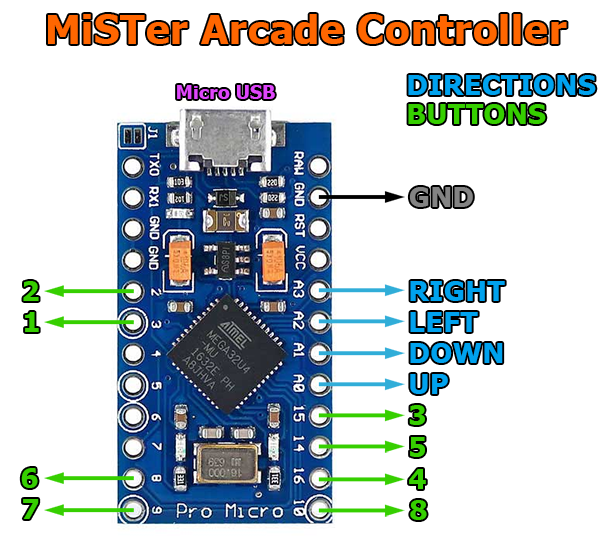
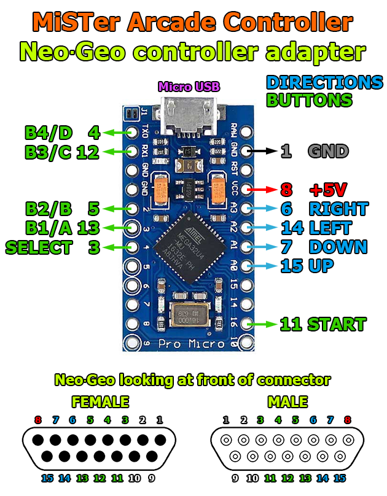
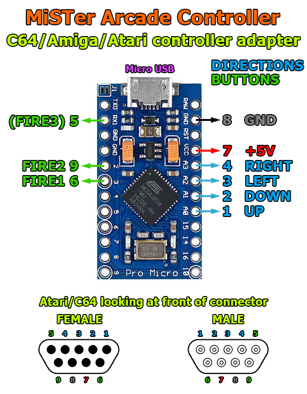

# MiSTer-Arcade-Controller
This is an arcade controller project for the MiSTer and any other device accepting USB HID joysticks using an Arduino Pro Micro. The input lag for the Arduino configured as a joystick/gamepad is very low, lower than the "Zero Delay" USB encoders. This project can also be used to create a NeoGeo/Atari/Commodore/Amiga controller to USB adapters.

## Wiring (Arcade Controller)
The wiring is simple. Connect one leg of each microswitch to GND and the other leg to the digital pin according to the schematic below. That's it!  

## Wiring (NeoGeo USB Adapter)

## Wiring (Atari/Commodore/Amiga USB Adapter)

## Programming the Arduino
1. Download the free Arduino IDE: https://www.arduino.cc/en/main/software
2. Connect the Arduino Pro Micro to a USB port and let the drivers install.
3. Choose the correct board and virtual COM port in the IDE.
3. Compile/Upload the project.
