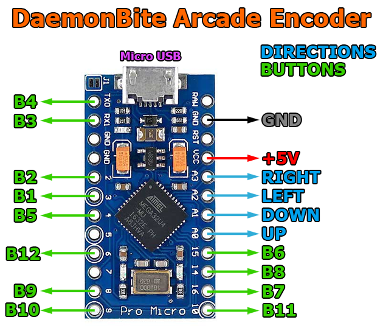
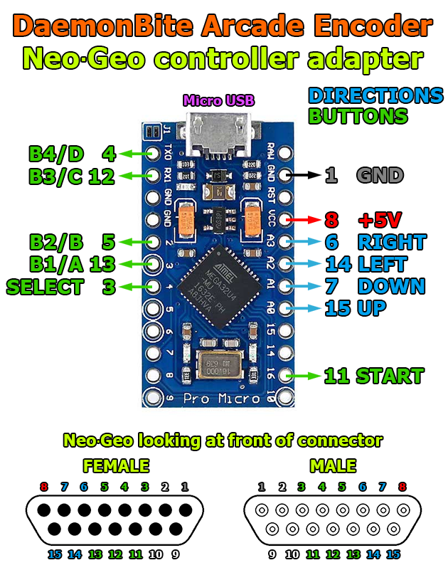
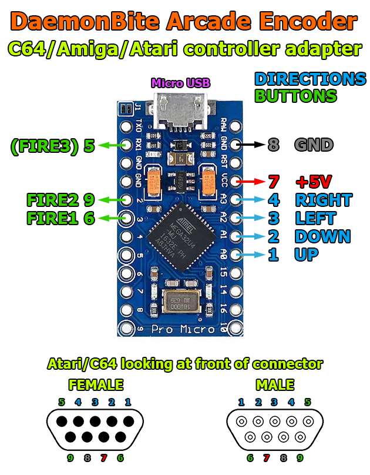

# DaemonBite-Arcade-Encoder
This is an arcade controller project for the MiSTer FPGA project and any other device accepting USB HID joysticks using an Arduino Pro Micro. This project can also be used to create a NeoGeo/Atari/Commodore/Amiga controller to USB adapters.

The input lag for an arcade controller or adapter built around this project is minimal. Here is the result from a test with a 1ms polling rate on a MiSTer with this project:

| Samples | Average | Max | Min | Std Dev |
| ------ | ------ | ------ | ------ | ------ | 
| 13962 | 0.74ms | 1.28ms | 0.23ms | 0.29ms |

## Wiring (Arcade Controller)
The wiring is simple. Connect one leg of each microswitch to GND and the other leg to the digital pin according to the schematic below. That's it!  

## Wiring (NeoGeo USB Adapter)

## Wiring (Atari/Commodore/Amiga USB Adapter)

## Programming the Arduino
1. Download the free Arduino IDE: https://www.arduino.cc/en/main/software
2. Connect the Arduino Pro Micro to a USB port and let the drivers install.
3. Choose the correct board and virtual COM port in the IDE.
3. Compile/Upload the project.
